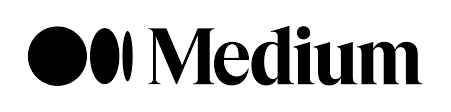

<h1 align="center"> Hey there 👋  This is <a href="https://github.com/rachitdani">Rachit</a> here :exclamation:  </h1>
<h2 align="center"> Data Analyst & Scientist :computer: 💹 </h2>

 

---

 <h3>Get to know me :dart: </h3>

- Providing Data-driven insights from analyzing data
- Here are some of my developed <a href = "https://github.com/rachitdani/Projects.git">Projects</a> 👈👈
- Take a quick peek at my <a href = "https://drive.google.com/file/d/1WdjUu7FDEPmOSWuWav1uQLxA7vpd6sfA/view?usp=sharing">Resume</a> 👈👈

--- 

<h3> Connect with Me :mag: </h3> 

---

<h3>Languages and Tools :hammer_and_wrench:</h3>

 

 

---
  
  <h3> GitHub Stats 	🔥🔥 : </h3>  
  
 
  
  
   
  

<!--
**rachitdani/rachitdani** is a ✨ _special_ ✨ repository because its `README.md` (this file) appears on your GitHub profile.

Here are some ideas to get you started:

- 🔭 I’m currently working on ...
- 🌱 I’m currently learning ...
- 👯 I’m looking to collaborate on ...
- 🤔 I’m looking for help with ...
- 💬 Ask me about ...
- 📫 How to reach me: ...
- 😄 Pronouns: ...
- ⚡ Fun fact: ...
-->
